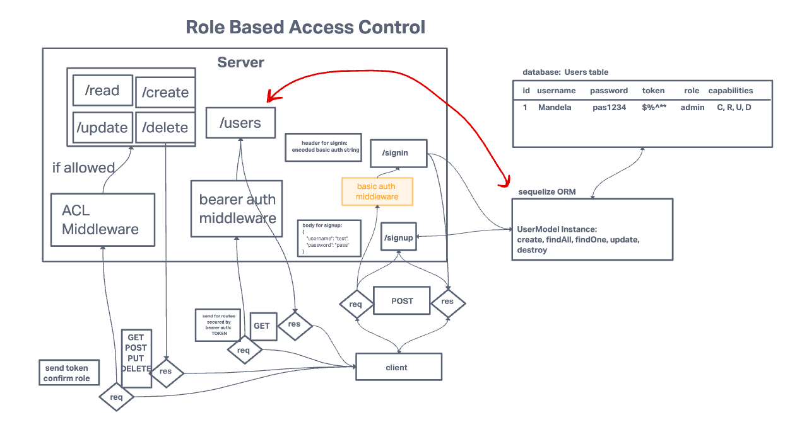

# LAB - Class 07

## Project: Bearer Authorization

### Author: Mandela Steele-Dadzie

### Problem Domain  

Authentication Server Phase 2: Token (Bearer) Authentication

### Setup

Bearer authentication system that allows user to:
    - obtain a token after signin in order to re-authenticate
    - use their token to access routes that require a valid user token
    - secure their token using a secret

#### How to use your library (where applicable)

#### Features / Routes

- POST : `/signup`
- POST : `/signin`
- GET : `/users`
- GET : `/secret`

#### UML

